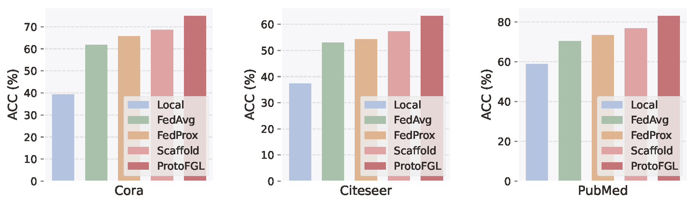
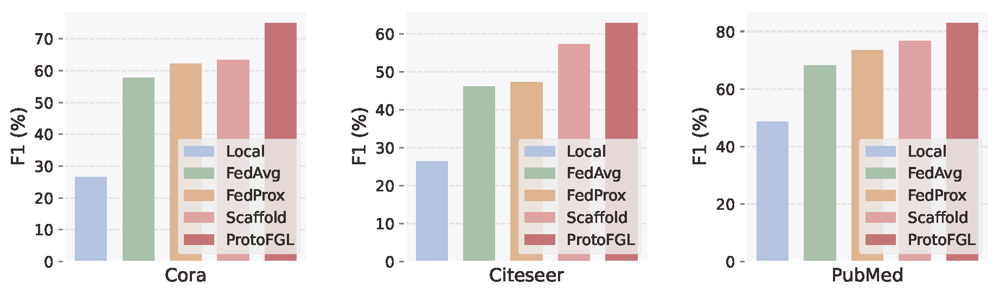
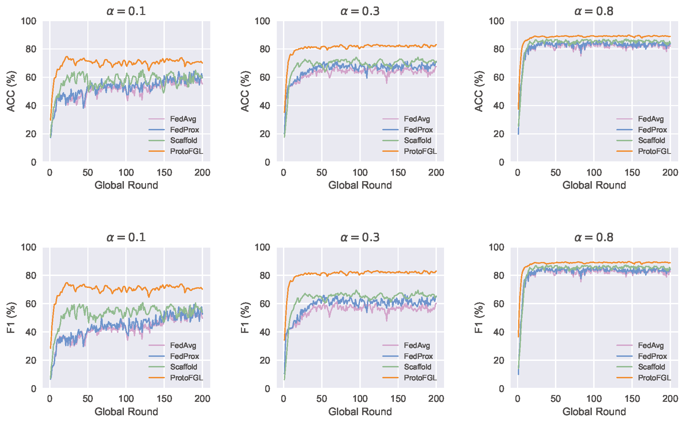
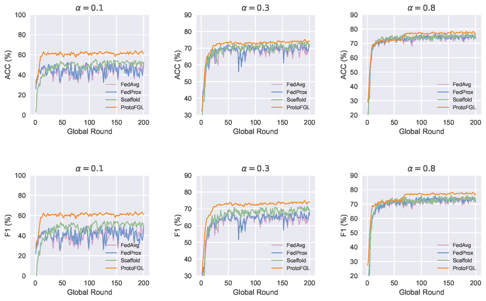
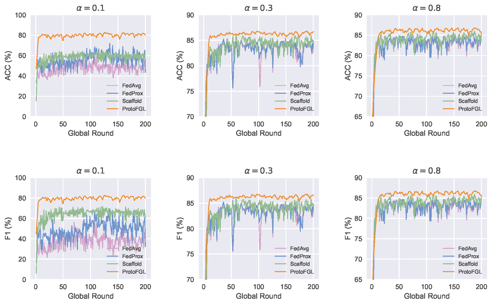
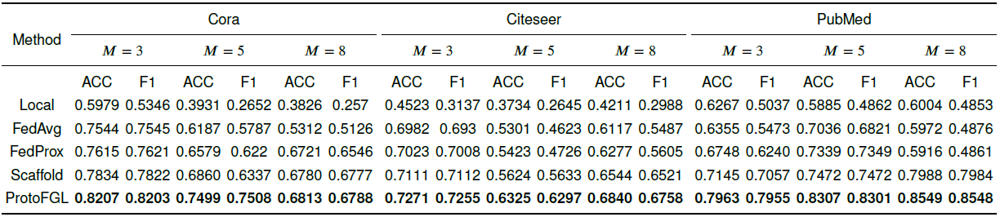
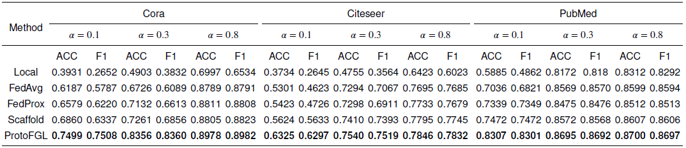
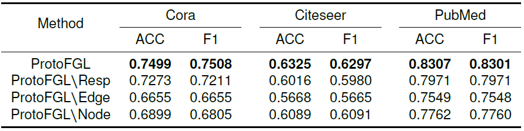
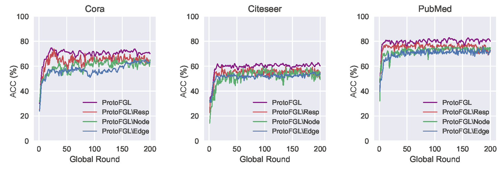

# ProtoFGL

An illustration of the overall process of ProtoFGL. (1) Local prototype learning (client-side): For node heterogeneity, we conduct a category-fair sampling for all node categories in the local graph to construct the meta-learning tasks. For structure heterogeneity, we train $\mathit{Encoder}$ and $\mathit{Scorer}$ to score the importance of nodes based on the edge connection. For representation heterogeneity, node representations of each category are aggregated into a local prototype separately weighted by node importance scores. Besides, we alleviate representation heterogeneity through distilling the knowledge from the global prototypes. (2) Global prototype aggregation (server-side): The server aggregates local prototypes and model parameters based on the local nodes' labels and quantities, and then sends the learned global prototypes and model parameters to clients.

The raw data can be found at this link：https://pytorch-geometric.readthedocs.io/en/latest/generated/torch_geometric.datasets.Planetoid.html#torch_geometric.datasets.Planetoid

# Evaluation

In this section, we first introduce the experimental settings, then present and analyze the experimental results on three real-world datasets to demonstrate the effectiveness of ProtoFGL.

**Metrics** We use two widely used metrics (${i.e.}$, accuracy (ACC) and F1 score (F1)) to evaluate the performance of different methods in global node classification tasks.

## Experimental results
In this subsection, we firstly evaluate the effectiveness by comparing the overall performance of ProtoFGL and the baseline methods. Then we evaluate the efficiency by comparing the convergence of different methods during the training process. Additionally, we simulate multiple heterogeneous scenarios and conduct experiments with different $\alpha$ values and numbers of clients to analyze the impact of these parameters and the effectiveness of ProtoFGL in different heterogeneous settings. Finally, we perform ablation experiments to demonstrate the effectiveness of each module in ProtoFGL.

### Overall performance

 

(a) The overall results of ACC.

(b) The overall results of F1.

**Figure 1:** The overall results of ACC and F1 on node classification.

Figure 1 demonstrates the results on overall performance of our ProtoFGL and baselines. It indicates that ProtoFGL achieves excellent ACC and F1 for the global node classification tasks. Whatever the dataset, ProtoFGL shows significant performance gains over the baseline methods. Particularly, ProtoFGL surpasses FedAvg by achieving an average increase of 10.75$\%$ in ACC, and attains the highest ACC improvement on PubMed with a boost of 12.71$\%$. In addition, ProtoFGL outperforms FedProx and Scaffold that also address the data heterogeneity in FL. Specifically, it improves the average ACC by 5.65$\%$ and 3.34$\%$, and the average F1 by 6.01$\%$ and 4.35$\%$.

### Analysis of the training process
Data heterogeneity among clients greatly hinders the global model convergence. Here we investigate the training process of various methods under different levels of subgraph heterogeneity. To simulate the settings, the heterogeneity coefficient $\alpha$ is set to $\{0.1, 0.3, 0.8\}$.

**Figure 2:** Variation of ACC and F1 during the training process under different heterogeneity coefficient. (Cora)

**Figure 3:** Variation of ACC and F1 during the training process under different heterogeneity coefficient. (Citeseer)

**Figure 4:** Variation of ACC and F1 during the training process under different heterogeneity coefficient . (PubMed)

As presented in Figures 2-4, ProtoFGL exhibits a convergence stability advantage over other baselines and requires fewer training iterations to achieve convergence. Regardless of the heterogeneity level, ProtoFGL demonstrates superior convergence stability and ACC compared to other baselines. Moreover, when the subgraph heterogeneity is stronger ($i.e.$, smaller values of coefficient $\alpha$), there exist significant fluctuations in the convergence of FedAvg, FedProx, and Scaffold, whereas ProtoFGL shows smaller convergence fluctuations and significantly higher ACC compared to these baselines.  

### Impact of the number of clients

**Table 1:** The overall results of ACC and F1 in different number of clients $M$ ($\alpha=0.1$). The best results are in bold.

We evaluate how the number of clients affects the performance of methods. In the simulation, we distribute each dataset into 3, 5, and 8 clients, respectively. As demonstrated in Table 1, ProtoFGL achieves the best ACC and F1 in the scenarios with different client scale. The results indicate that the number of clients has a significant impact on the performance of FedAvg and FedProx, whereas ProtoFGL presents better stability. For example, in the Citeseer dataset, as the number of clients increases from 3 to 8, which is considered to increase data heterogeneity, FedProx's ACC decreases by 8.46$\%$, while ProtoFGL only decreases by 5.13$\%$. 

### Impact of LDA coefficient $\alpha$

**Table 2:** The overall results of ACC and F1 in various $\alpha$ ($M=5$). The best results are in bold.

To examine the robustness of our ProtoFGL in various subgraph heterogeneity scenarios, we conduct experiments by varying the coefficient $\alpha$. $\alpha$ is set to $\{0.1, 0.3, 0.8\}$, corresponding to strong, moderate, and weak heterogeneity, respectively. As presented in Table 2, the results of ProtoFGL demonstrate its superior ACC and F1. It reflects ProtoFGL's remarkable robustness in these heterogeneity scenarios, particularly when the coefficient $\alpha = 0.1$. It is noteworthy that the baselines perform similarly to ProtoFGL in scenarios with weak data heterogeneity ($\alpha = 0.8$). However, as the level of data heterogeneity increases, the ACC and F1 of the baselines exhibit significant declines, while ProtoFGL exhibits stronger robustness. Specifically, ProtoFGL outperforms FedAvg, FedProx, and Scaffold by 9.15$\%$, 7.43$\%$, and 5.48$\%$ on average in terms of ACC. ProtoFGL outperforms FedAvg, FedProx, and Scaffold by an average of 9.06$\%$, 7.66$\%$, and 5.57$\%$ on F1, respectively. Thus, ProtoFGL shows its superiority in the case of great subgraph heterogeneity. 

### Ablation study
In this section, we investigate the effectiveness of different module components in ProtoFGL. Our ablation experiments are designed for different modules of ProtoFGL: (1) Representation heterogeneity: we removed the knowledge distillation design in local training, so that clients only use local prototypes during their training. We refer to this variant as ProtoFGL$\backslash$Resp. (2) Edge connection heterogeneity: we removed the $\mathit{Scorer}$ and replaced the aggregation based on importance with an aggregation regardless of each edge connection structure. This variant is denoted as ProtoFGL$\backslash$Edge. (3) Node Label heterogeneity: we removed the meta task sampling design and replaced it with random sampling. We refer to this variant as ProtoFGL$\backslash$Node.

**Table 3:** The overall results of ACC and F1 score in the ablation study. The best results are in bold.

We conducted experiments on ProtoFGL and its variants on three datasets, and the overall ACC results are shown in Table 3. We found that ProtoFGL outperforms ProtoFGL$\backslash$Resp, ProtoFGL$\backslash$Edge, and ProtoFGL$\backslash$Node significantly. It demonstrates the effectiveness of each individual modules in the ProtoFGL method. On the Cora dataset, ProtoFGL achieves an average improvement of 5.57$\%$ and 6.18$\%$ in terms of ACC and F1 compared to ProtoFGL$\backslash$Resp, ProtoFGL$\backslash$Edge, and ProtoFGL$\backslash$Node. On the PubMed dataset, ProtoFGL achieves an average improvement of 4.01$\%$ and 3.85$\%$ in ACC and F1 compared to ProtoFGL$\backslash$Resp, ProtoFGL$\backslash$Edge, and ProtoFGL$\backslash$Node. On the Citeseer dataset, ProtoFGL improves ACC and F1 by 5.40$\%$ and 5.41$\%$, respectively. In summary, it indicates the necessary to consider each level of subgraph heterogeneity. 

**Figure 5:** Variation of ACC during the training process in the ablation study.

We further conducted convergence analysis experiments on the three datasets, as shown in Figure 5. ProtoFGL demonstrates better convergence stability during the training process on all three datasets compared to the other variants. The improvement of convergence stability is more pronounced on the Cora and Citeseer datasets, while the effect is less significant on the PubMed dataset. This is because our ProtoFGL is more tailored for scenarios with stronger heterogeneity. The PubMed dataset has a larger number of nodes and fewer categories, resulting in weaker heterogeneity among clients after LDA processing compared to the Citeseer and Cora datasets. However, even in cases of weaker heterogeneity, ProtoFGL still exhibits better convergence stability than other variants.
